# TUTORIAL – DISEÑO LÓGICO
### Mariana Solano Gutiérrez

---

# 1. Instalación de las herramientas

Guía para la construcción del entorno de desarrollo de código abierto para la FPGA **Tang Nano 9K**.  
En esta sección se van a describir los pasos para instalar y configurar los programas requeridos para la correcta utilización del FPGA en el curso.

---

## Instalación de la extensión Lushay Code

La extensión **Lushay Code** permite integrar el flujo de trabajo de diseño para FPGA dentro de **Visual Studio Code**, facilitando la compilación, simulación y programación de los diseños digitales.

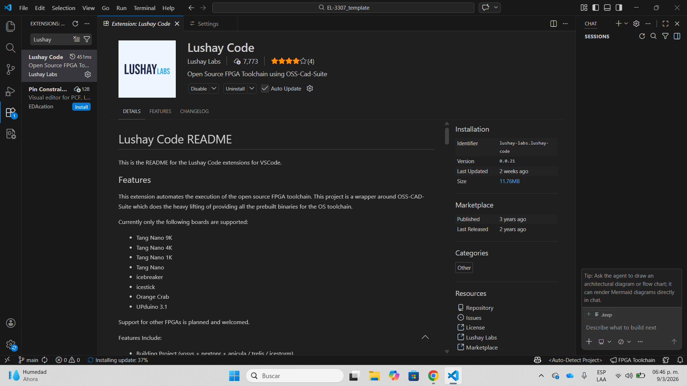

---

## Instalación del OSS CAD Suite en Visual

El **OSS CAD Suite** es un conjunto de herramientas de código abierto utilizadas para el desarrollo de sistemas digitales en FPGA.  
Incluye programas como **Yosys** (Que se probará proximamente), los cuales permiten realizar la simulación y programación del FPGA.

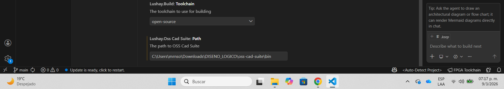

---

## Configuración del driver USB de Windows con Zadig

El programa **Zadig** se utiliza para instalar o configurar los drivers USB necesarios para que el sistema operativo pueda reconocer correctamente la FPGA **Tang Nano 9K** y permitir su programación desde la computadora.

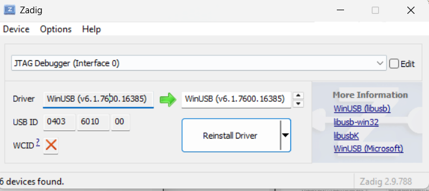

---

## Instalación de GNU Make y configuración de las variables de entorno de Windows

**GNU Make** es una herramienta que permite automatizar el proceso de compilación del proyecto.  
A través del archivo **Makefile** se ejecutan automáticamente los comandos necesarios para simular y cargar el diseño en la FPGA.

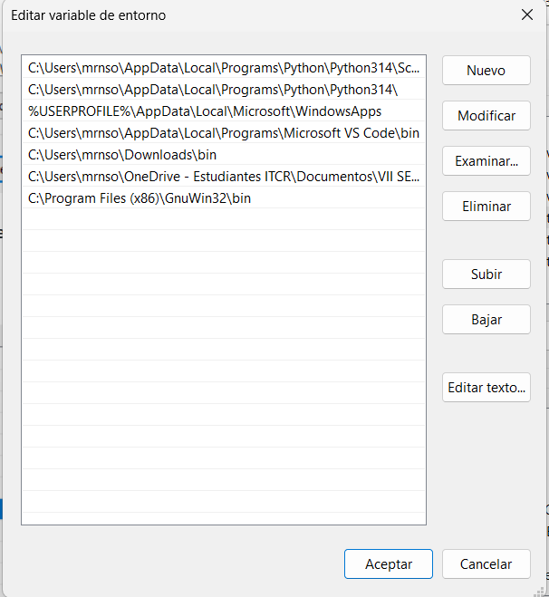

---

# 2. Uso del toolchain para diseño en FPGA

En esta sección se muestra el código de trabajo utilizado para compilar y simular diseños digitales utilizando las herramientas instaladas previamente.

---

## Carpetas y archivos necesarios

El proyecto contiene diferentes carpetas que organizan los archivos necesarios para el diseño, simulación y compilación del sistema digital.

---

## Clonación del repositorio para los proyectos

Se clona el repositorio que contiene los ejemplos y proyectos necesarios para trabajar con la FPGA Tang Nano 9K.

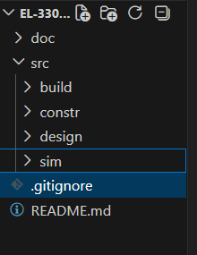

---

## Clonación del repositorio para el tutorial

Posteriormente se clona el repositorio correspondiente al tutorial que se utilizará para realizar las pruebas en el FPGA y comprobar que todo se instaló correctamente.

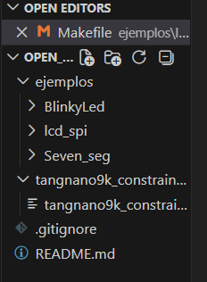

---

## Inicializar la terminal del toolchain

Se inicializa la terminal del entorno de desarrollo que contiene todas las herramientas necesarias para ejecutar los comandos de compilación y simulación.

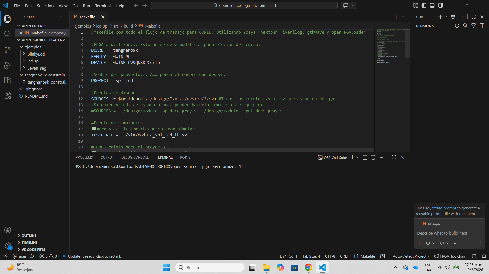

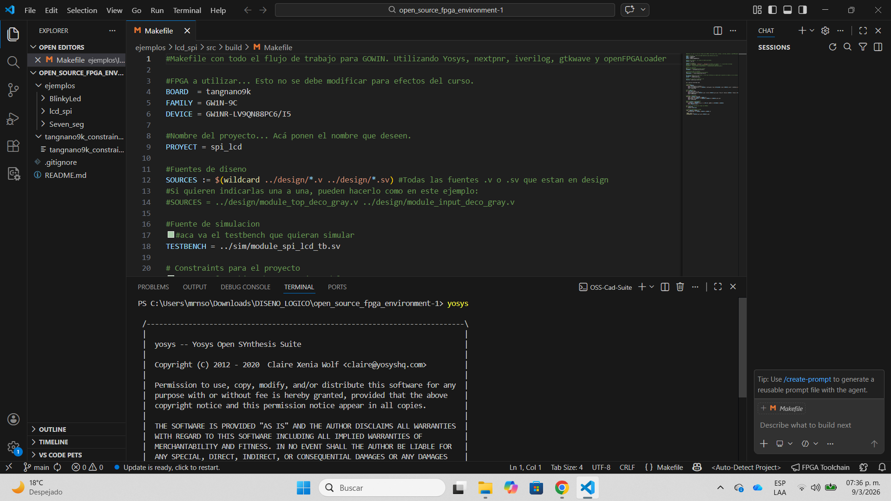

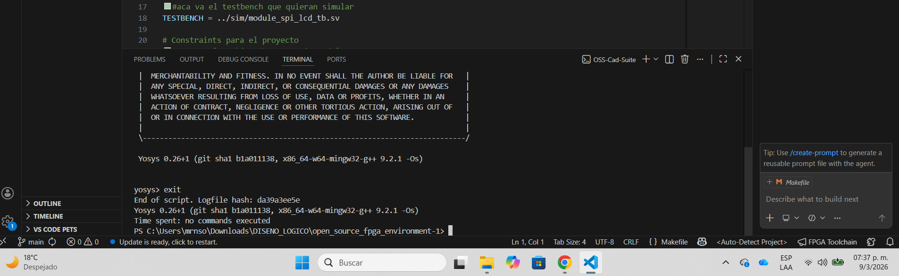

---

## Cambiar la dirección de la ruta a `build`

Se navega hacia la carpeta **build**, donde se ejecutarán los comandos necesarios para compilar y simular los diseños.

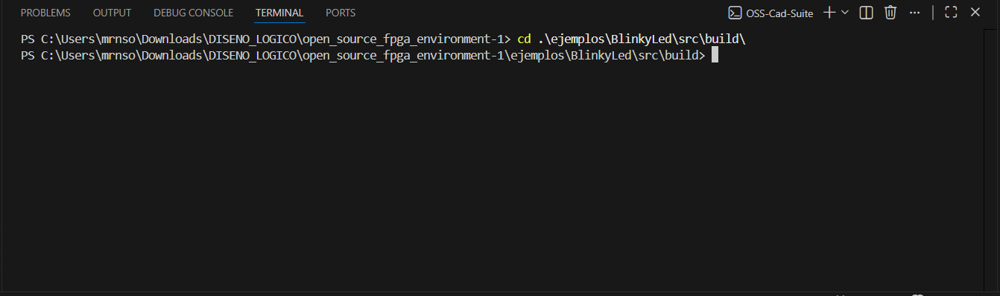

---

## Verificación de los diseños y simulación

A continuación se ejecutan los comandos necesarios para verificar el funcionamiento del diseño, compilar el código y realizar la simulación antes de programarlo en la FPGA.

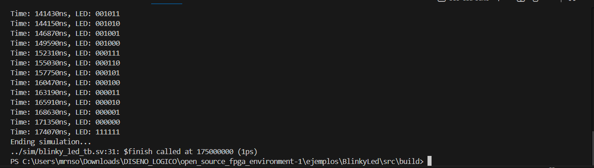

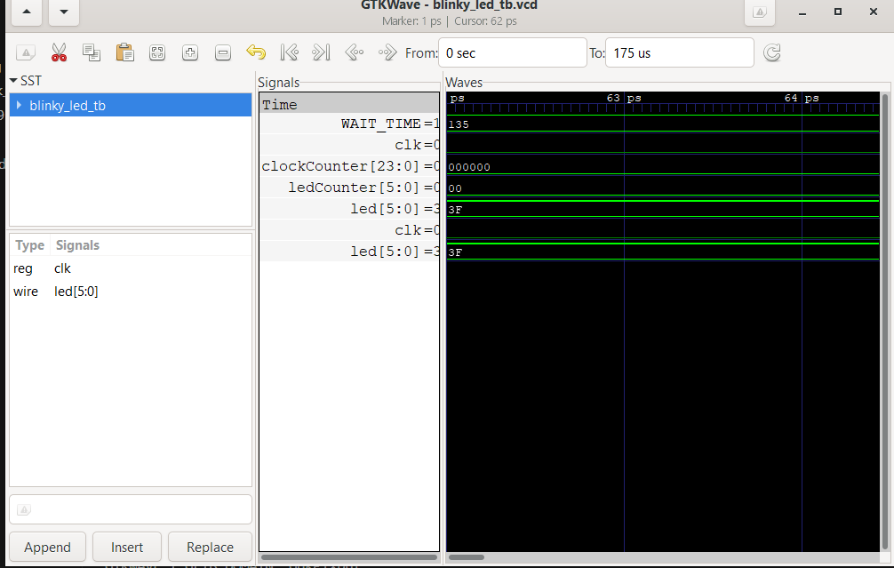

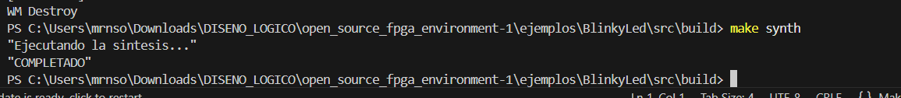

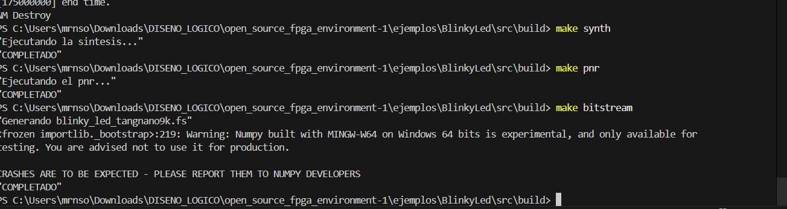

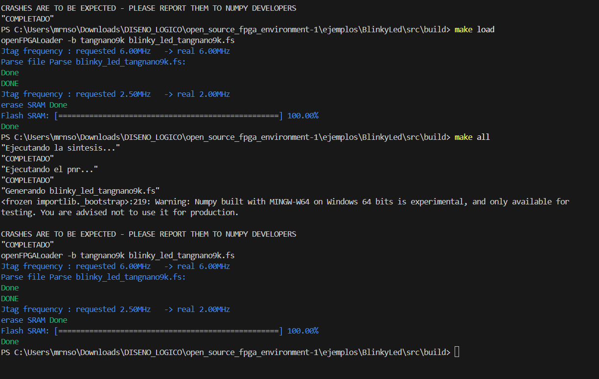

---

# 3. Descarga de la plantilla

En esta sección se muestra la plantilla de proyectos ya instalada dentro de **Visual Studio Code**, la cual es la que posteriormente se va a utilizar para realizar los proyectos del curso.

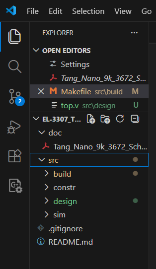

---

# 4. Primer diseño: Display de 7 segmentos

Se implementa un diseño básico para controlar un **display de 7 segmentos** utilizando la FPGA Tang Nano 9K.

Este tipo de display permite representar números mediante la activación de diferentes combinaciones en el switch.

A continuación se muestra el funcionamiento del circuito con el display alimentado a **5V** por medio de la FPGA.

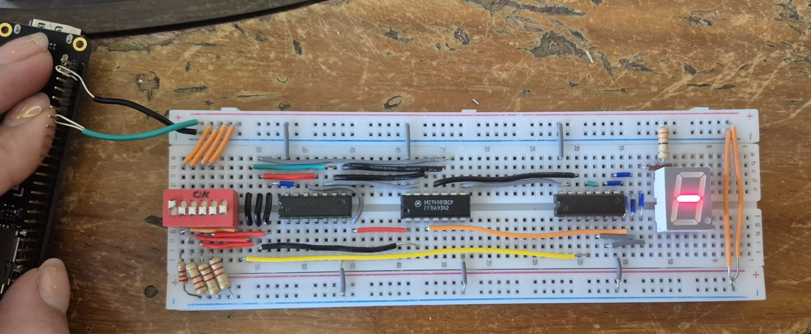

---

## Configuración de la FPGA desde la programación

El proceso de compilación y programación de la FPGA se realiza mediante comandos definidos dentro del archivo **Makefile**, el cual automatiza, implementa y carga el diseño.

A continuación se muestran algunos de los comandos utilizados.

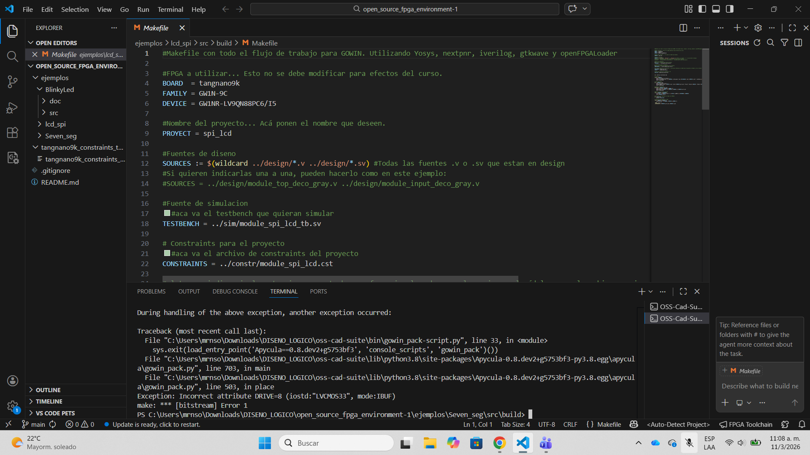

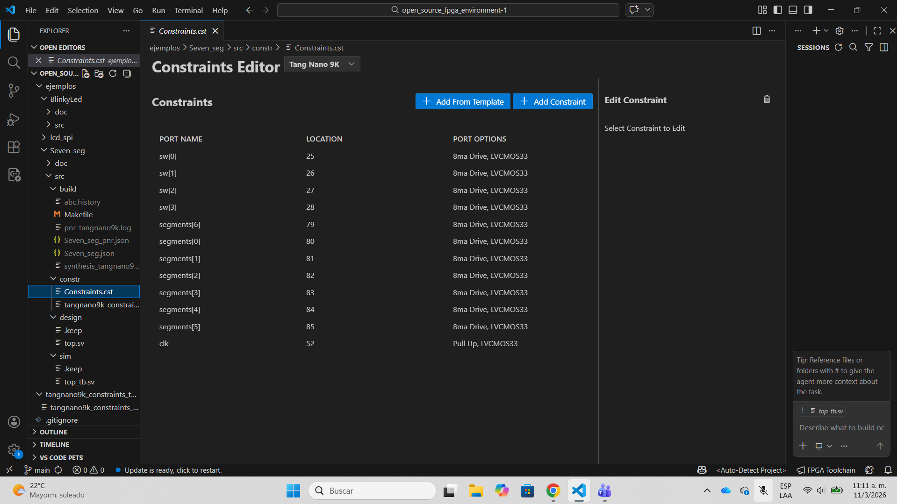

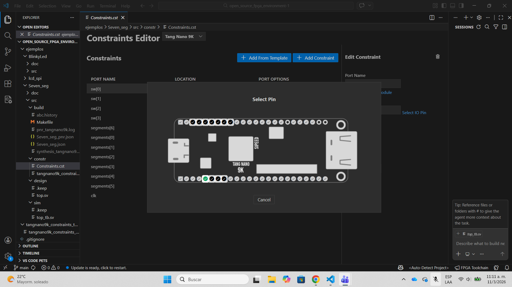
